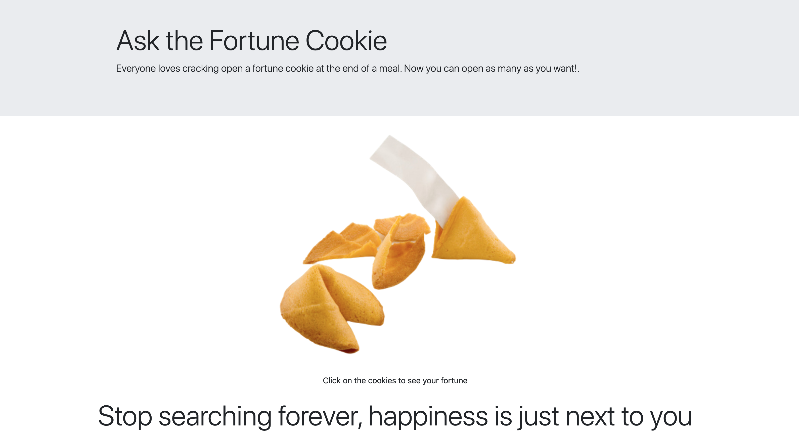
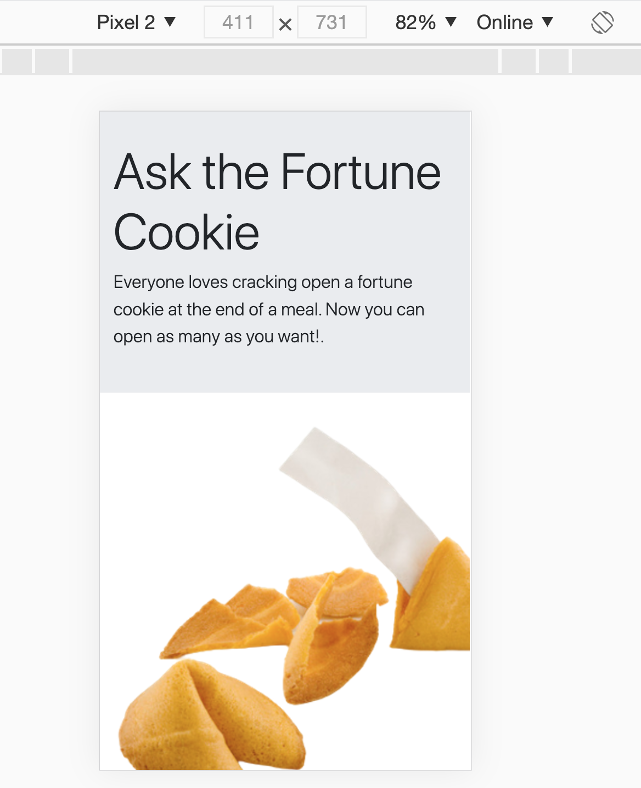
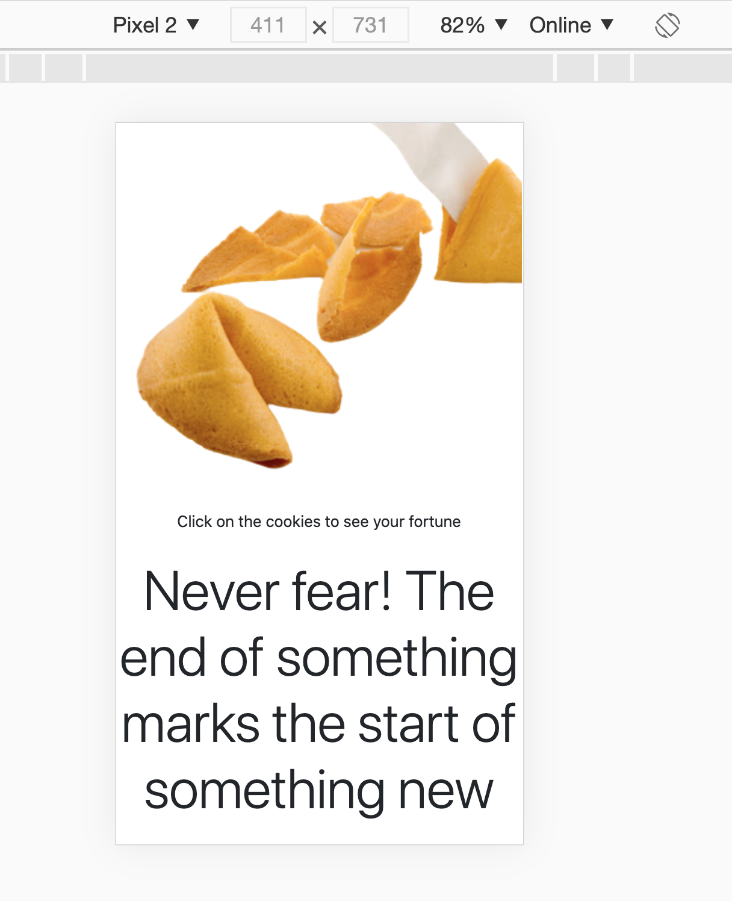
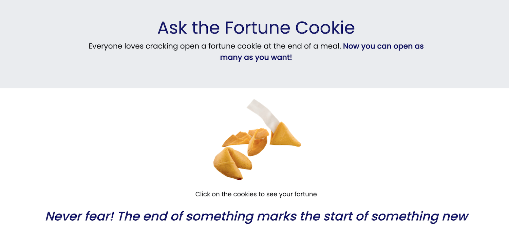
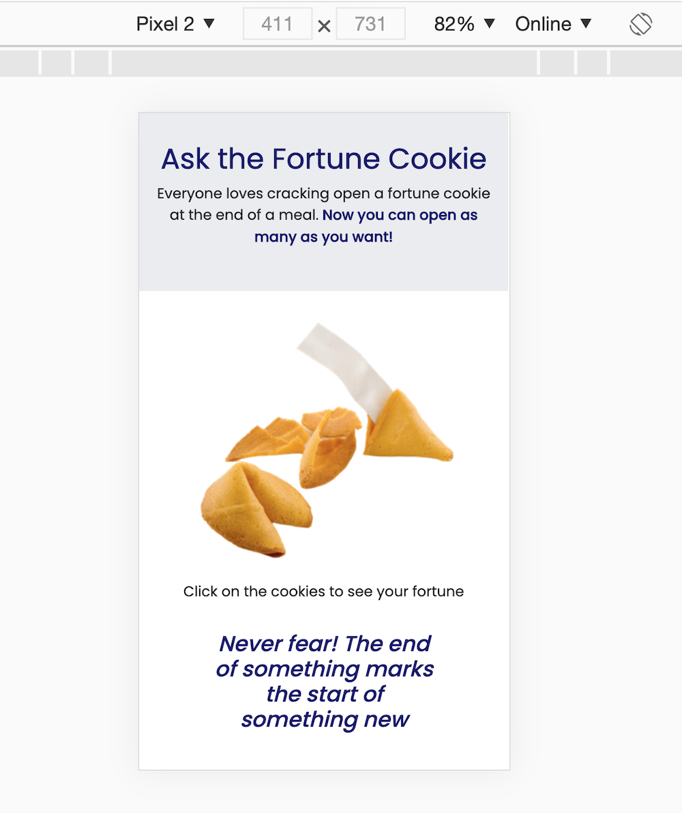

## Fortune Cookie

**Goal:** When the user clicks on the fortune cookie, it shows a random quote.

I created this project on 7/3/2020 as my second project. 
At the time, I used Bootstrap to create the layout of the page. The page was not responsive.

As I advanced in the Web Development course, I learned CSS and Flexbox, so I decided that It was time to update the **Fortune Cookie** page by using flexbox and media queries. Here is the result.

#### Before Flexbox and Media Queries

#### After Flexbox and Media Queries

Click [here](https://aoliveiramagalhaes.github.io/fortune-cookie/) to see a demo.

